# 🏃‍♂ 러닝메이트 🏃‍♀

## 러닝메이트가 무엇일까?
- 달리기(Running) + 친구(Mate) = RunningMate
- 러닝 코스중에서도 사람이 많고 달리기 좋은 명소가 있음
- 러닝에 대한 여러가지 정보를 공유할 커뮤니티 사이트가 부족함
- 함께 달릴 친구도 구할 수 있고, 인스타그램 스토리 처럼 나의 이야기를 인증하고 쓸 수 있음
- 궁극적으로 운동에 대한 흥미를 갖게 함

 

## 만들게 된 배경
- 한국인 중 주 3회 이상 하루 30분 이상 운동 하는 비율은 42.7% 정도
- 그 중에 가장 높은 비율의 운동은 걷기 및 조깅(러닝)
- 운동을 혼자 하다가 흥미를 갖기전에 관두는 경우가 多
- 러닝코스 공유등과 운동할 메이트를 만들 수 있는 플랫폼을 만들고자 프로젝트를 시작함

 

&ensp;&ensp;&ensp;&ensp;&ensp;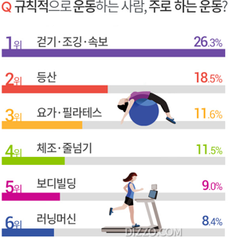

 

# Demo
[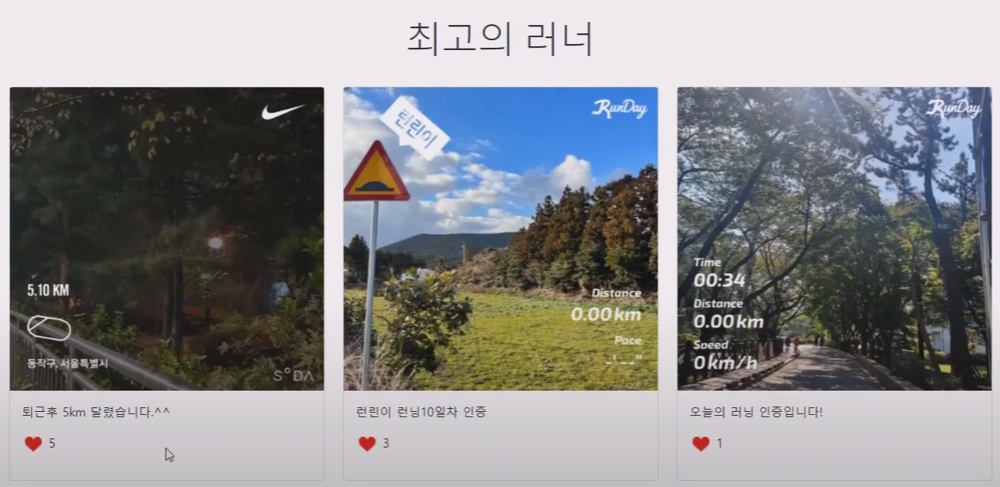](https://www.youtube.com/watch?v=7uexY16tpgA&t=225s)

 

# 프로젝트 일정

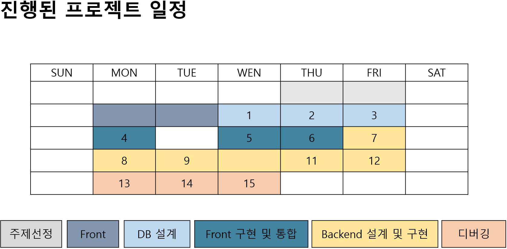

 

# 기능 구조

 <b>다이어그램</b> 

 
  
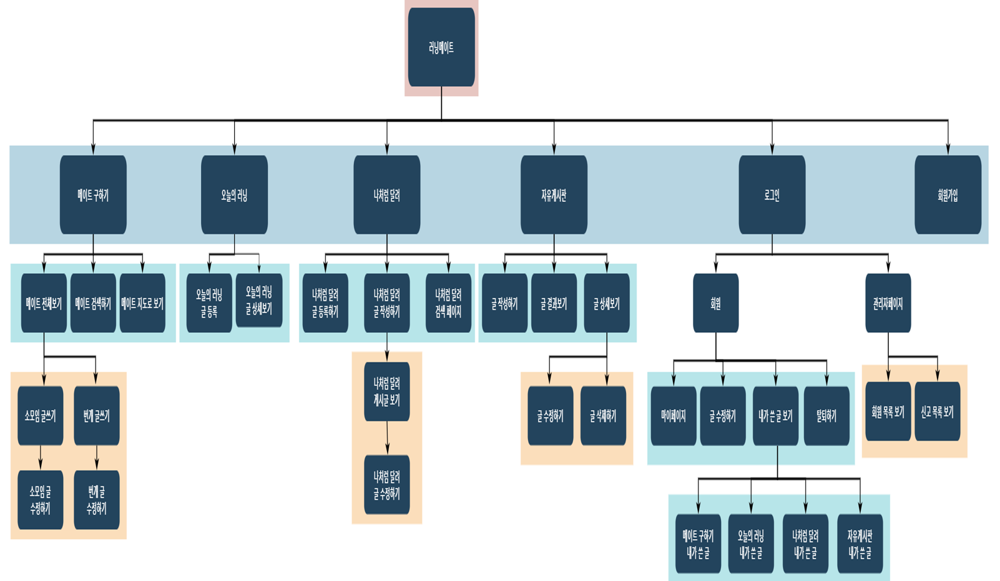
  
 

 

### 메이트

- 메이트 전체 보기
- 메이트 검색
- 메이트 지도로 검색

 

### 오늘의 러닝
- 오늘의 러닝 인증
- 오늘의 러닝 자세히 보기

 

### 나처럼 달려
- 나처럼 달려 글 등록
- 나처럼 달려 CRUD
- 검색

 

### 자유게시판
- 자유게시판 CRUD
- 댓글 및 좋아요

 

### 사용자 
- 마이페이지 (유저)
- 내 활동 및 이력 관리 (유저)
- 탈퇴하기 (유저)
- 회원 리스트 (관리자)
- 신고 리스트 (관리자)
- 회원가입

 
 

## 기능

 <b>메인, 회원, 마이페이지, 관리자 페이지</b> 

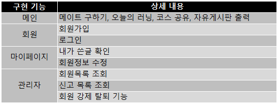

 <b>메이트 구하기</b> 

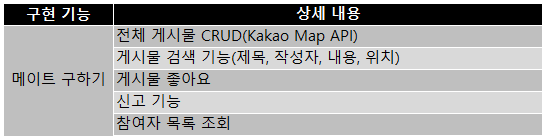
 

 <b>오늘의 러닝</b> 

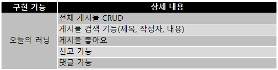

 <b>코스 공유</b> 

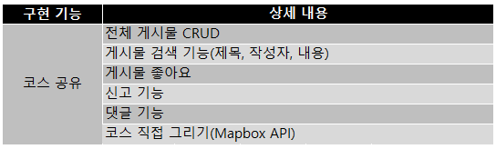

 <b>자유게시판</b> 

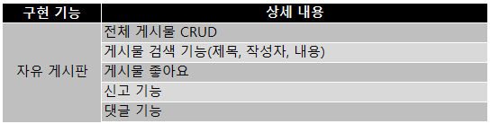
 

 

# 클래스 구조

 <b>메인페이지</b> 

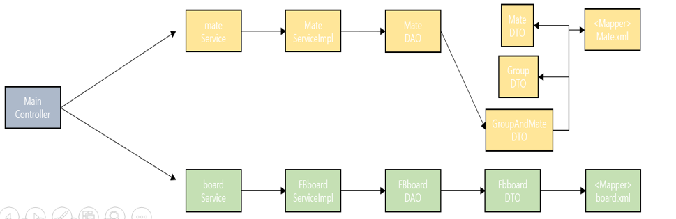

 

 <b>멤버</b> 

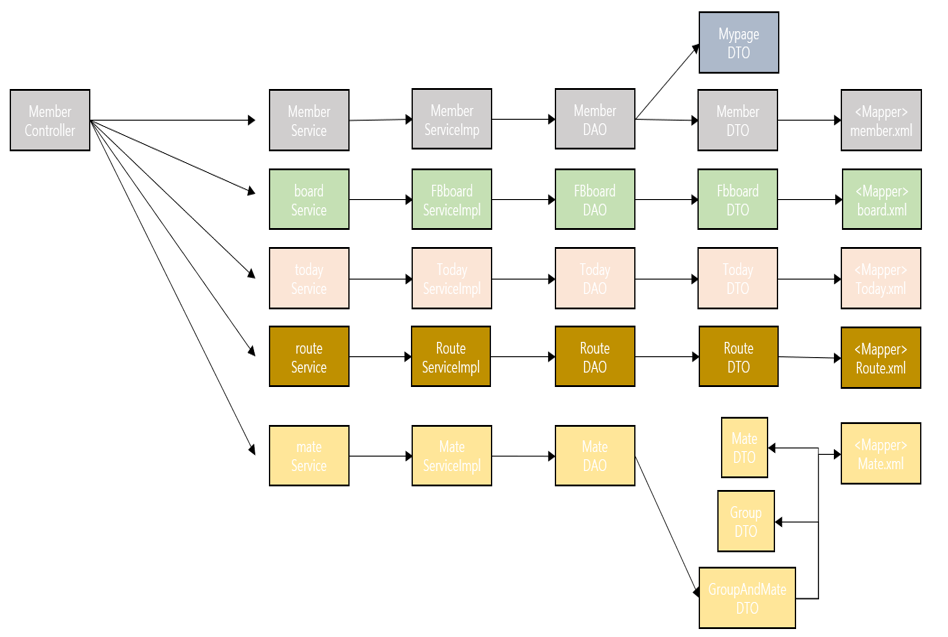

 

 <b>자유게시판</b> 

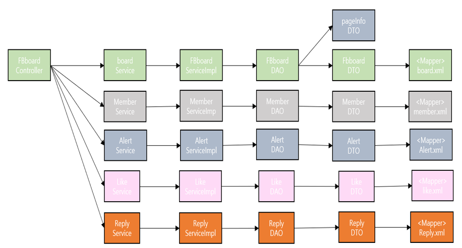

 

 <b>오늘의러닝</b> 

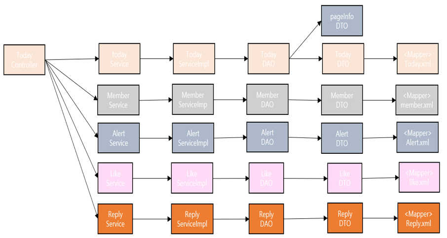

 

 <b>메이트구하기</b> 

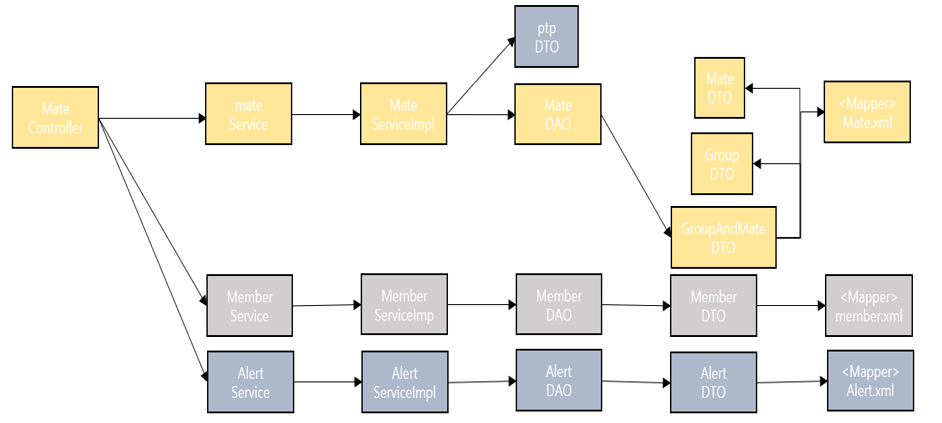

 

 <b>공통기능</b> 

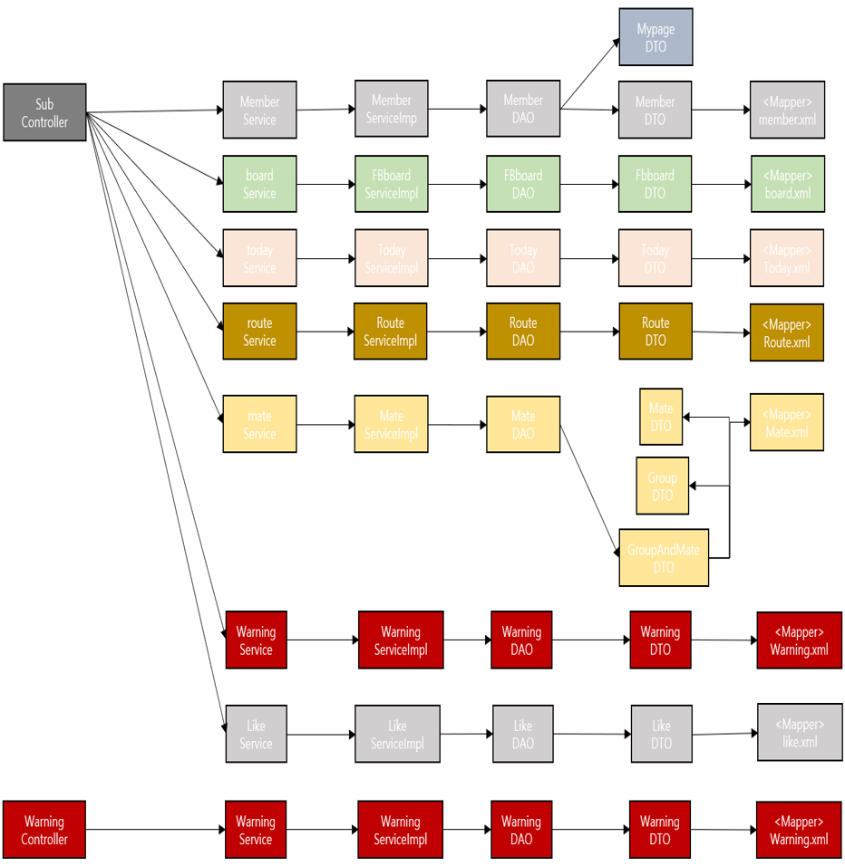

 

 <b>코스공유</b> 

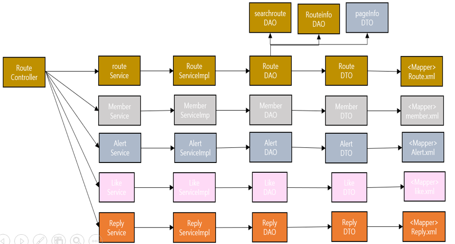

 

 

# 데이터베이스

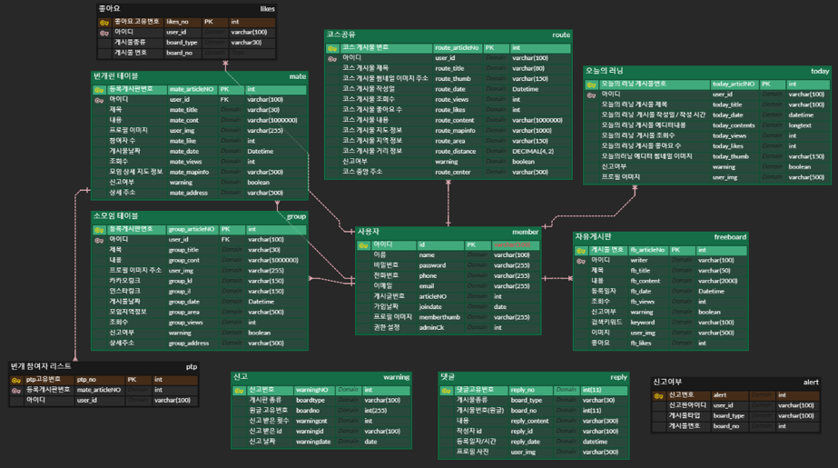

 
 

# 팀원 및 

 <b>채효주(PL)</b> 

* 로그인, 회원가입 CRUD 구현
* 마이페이지 JSP 디자인 설계 및 구현
* 내가 쓴 글 보기
* 회원목록 조회 / 회원 강제 탈퇴
* 신고목록 조회 및 해당 게시물 삭제

 

 <b>김상원</b> 

* 메인페이지 JSP 디자인 설계 및 구현
* 최고의 러너 구현(오늘의 러닝) / 번개모임 미리보기
* 자유게시판 CRUD 페이징리스트 구현
* CKEditor5 으로 게시판 구현
* 게시글 검색 기능( 제목, 작성자 , 내용) 
* 댓글 front 구성 설계 및 구현

 

 <b>김민정</b> 

* 오늘의 러닝 JSP 구성 설계 및 구현
* 오늘의 러닝 CRUD 페이징 구현
* 게시물 썸네일 기능 구현
* CKEditor5으로 게시물 구현
* 게시물 검색 기능 (제목, 작성자, 내용)

 

 <b>홍성호</b> 

* 러닝메이트 구하기 JSP 구성 설계 및 구현
* 번개, 소모임 게시물 CRUD
* 번개 참여 기능, 참여자 리스트 기능
* 게시물 검색 기능(게시물 종류, 제목 등) 
* Kakao map api 사용 : 현재 위치 정보, 지도로 보기 등 구현
  

 

 <b>조예선</b> 
 

* “나처럼 달려” JSP 구성 설계 및 구현
* “나처럼 달려” 게시물 CRUD 페이징 구현
* CKEditor5 으로 게시물 구현
* Mapbox api 사용하여 코스 그리기
* 전체 댓글 기능 CRUD
* 전체 좋아요, 신고 DB 설계 및 구현

 
 

# 기술스택

 <b>Back-end</b> 

* JAVA SE-11
* Spring Boot
* Spring MVC
* Tomcat

 

 <b>Front-end</b> 

* HTML5
* CSS
* JavaScript
* jQuery
* BootStrap5

 

 <b>DBMS</b> 

* MySQL

 

 <b>DevOps</b> 

* Git/GitHub
* Naver Works
* oven.app
* erdcloud
* googleSheet

 

 <b>API & Library</b> 

* API Docs - mapbox
* Kakao API - KakaoMap
* Ck Editor  
  

러닝에 대한 여러가지  보를 공유하고
러닝메이트를 구하는 러닝 커뮤니티 사이트

멀티캠퍼스 풀스택 세미프로젝트 
